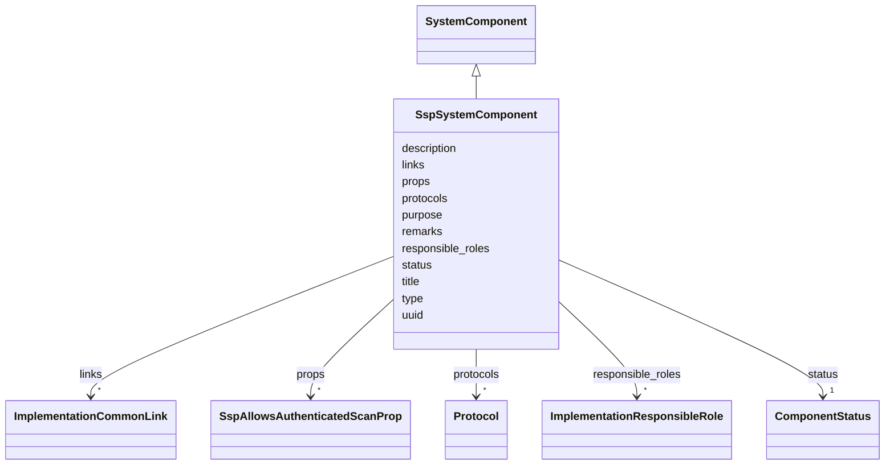

```mermaid
 classDiagram
    class SspSystemComponent
    click SspSystemComponent href "../SspSystemComponent"
      SystemComponent <|-- SspSystemComponent
        click SystemComponent href "../SystemComponent"
      
      SspSystemComponent : description
        
      SspSystemComponent : links
        
          
    
        
        
        SspSystemComponent --> "*" ImplementationCommonLink : links
        click ImplementationCommonLink href "../ImplementationCommonLink"
    

        
      SspSystemComponent : props
        
          
    
        
        
        SspSystemComponent --> "*" SspAllowsAuthenticatedScanProp : props
        click SspAllowsAuthenticatedScanProp href "../SspAllowsAuthenticatedScanProp"
    

        
      SspSystemComponent : protocols
        
          
    
        
        
        SspSystemComponent --> "*" Protocol : protocols
        click Protocol href "../Protocol"
    

        
      SspSystemComponent : purpose
        
      SspSystemComponent : remarks
        
      SspSystemComponent : responsible_roles
        
          
    
        
        
        SspSystemComponent --> "*" ImplementationResponsibleRole : responsible_roles
        click ImplementationResponsibleRole href "../ImplementationResponsibleRole"
    

        
      SspSystemComponent : status
        
          
    
        
        
        SspSystemComponent --> "1" ComponentStatus : status
        click ComponentStatus href "../ComponentStatus"
    

        
      SspSystemComponent : title
        
      SspSystemComponent : type
        
      SspSystemComponent : uuid
        
      
```
