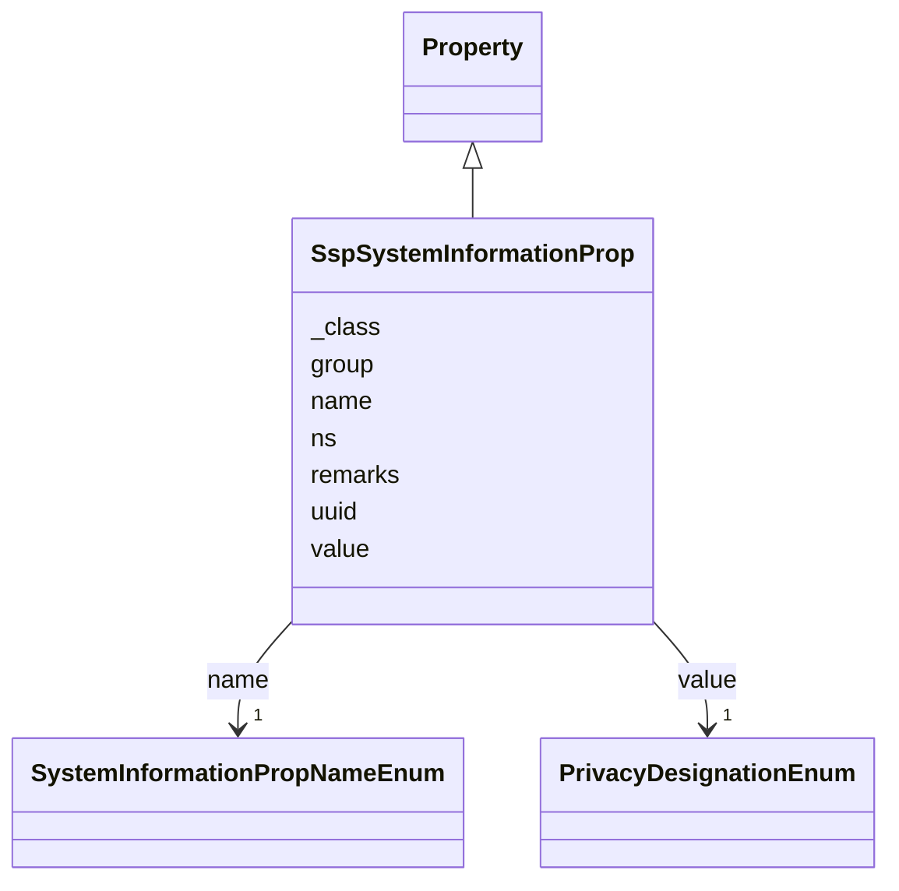

```mermaid
 classDiagram
    class SspSystemInformationProp
    click SspSystemInformationProp href "../SspSystemInformationProp"
      Property <|-- SspSystemInformationProp
        click Property href "../Property"
      
      SspSystemInformationProp : _class
        
      SspSystemInformationProp : group
        
      SspSystemInformationProp : name
        
          
    
        
        
        SspSystemInformationProp --> "1" SystemInformationPropNameEnum : name
        click SystemInformationPropNameEnum href "../SystemInformationPropNameEnum"
    

        
      SspSystemInformationProp : ns
        
      SspSystemInformationProp : remarks
        
      SspSystemInformationProp : uuid
        
      SspSystemInformationProp : value
        
          
    
        
        
        SspSystemInformationProp --> "1" PrivacyDesignationEnum : value
        click PrivacyDesignationEnum href "../PrivacyDesignationEnum"
    

        
      
```
