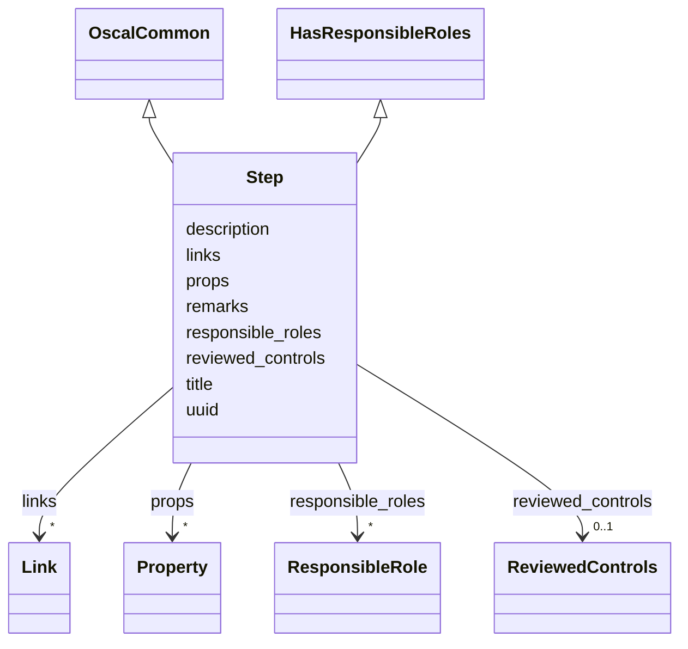

```mermaid
 classDiagram
    class Step
    click Step href "../Step"
      OscalCommon <|-- Step
        click OscalCommon href "../OscalCommon"
      HasResponsibleRoles <|-- Step
        click HasResponsibleRoles href "../HasResponsibleRoles"
      
      Step : description
        
      Step : links
        
          
    
        
        
        Step --> "*" Link : links
        click Link href "../Link"
    

        
      Step : props
        
          
    
        
        
        Step --> "*" Property : props
        click Property href "../Property"
    

        
      Step : remarks
        
      Step : responsible_roles
        
          
    
        
        
        Step --> "*" ResponsibleRole : responsible_roles
        click ResponsibleRole href "../ResponsibleRole"
    

        
      Step : reviewed_controls
        
          
    
        
        
        Step --> "0..1" ReviewedControls : reviewed_controls
        click ReviewedControls href "../ReviewedControls"
    

        
      Step : title
        
      Step : uuid
        
      
```
