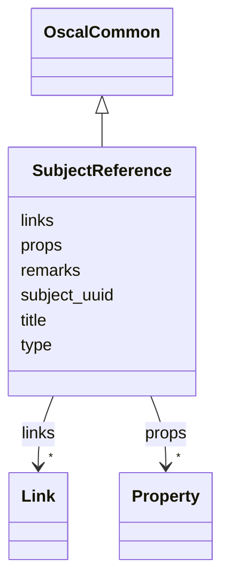

```mermaid
 classDiagram
    class SubjectReference
    click SubjectReference href "../SubjectReference"
      OscalCommon <|-- SubjectReference
        click OscalCommon href "../OscalCommon"
      
      SubjectReference : links
        
          
    
        
        
        SubjectReference --> "*" Link : links
        click Link href "../Link"
    

        
      SubjectReference : props
        
          
    
        
        
        SubjectReference --> "*" Property : props
        click Property href "../Property"
    

        
      SubjectReference : remarks
        
      SubjectReference : subject_uuid
        
      SubjectReference : title
        
      SubjectReference : type
        
      
```
