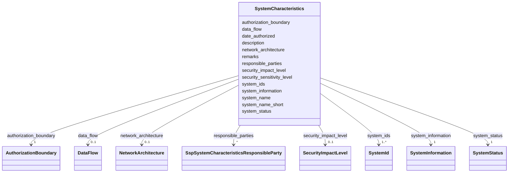

```mermaid
 classDiagram
    class SystemCharacteristics
    click SystemCharacteristics href "../SystemCharacteristics"
      SystemCharacteristics : authorization_boundary
        
          
    
        
        
        SystemCharacteristics --> "1" AuthorizationBoundary : authorization_boundary
        click AuthorizationBoundary href "../AuthorizationBoundary"
    

        
      SystemCharacteristics : data_flow
        
          
    
        
        
        SystemCharacteristics --> "0..1" DataFlow : data_flow
        click DataFlow href "../DataFlow"
    

        
      SystemCharacteristics : date_authorized
        
      SystemCharacteristics : description
        
      SystemCharacteristics : network_architecture
        
          
    
        
        
        SystemCharacteristics --> "0..1" NetworkArchitecture : network_architecture
        click NetworkArchitecture href "../NetworkArchitecture"
    

        
      SystemCharacteristics : remarks
        
      SystemCharacteristics : responsible_parties
        
          
    
        
        
        SystemCharacteristics --> "*" SspSystemCharacteristicsResponsibleParty : responsible_parties
        click SspSystemCharacteristicsResponsibleParty href "../SspSystemCharacteristicsResponsibleParty"
    

        
      SystemCharacteristics : security_impact_level
        
          
    
        
        
        SystemCharacteristics --> "0..1" SecurityImpactLevel : security_impact_level
        click SecurityImpactLevel href "../SecurityImpactLevel"
    

        
      SystemCharacteristics : security_sensitivity_level
        
      SystemCharacteristics : system_ids
        
          
    
        
        
        SystemCharacteristics --> "1..*" SystemId : system_ids
        click SystemId href "../SystemId"
    

        
      SystemCharacteristics : system_information
        
          
    
        
        
        SystemCharacteristics --> "1" SystemInformation : system_information
        click SystemInformation href "../SystemInformation"
    

        
      SystemCharacteristics : system_name
        
      SystemCharacteristics : system_name_short
        
      SystemCharacteristics : system_status
        
          
    
        
        
        SystemCharacteristics --> "1" SystemStatus : system_status
        click SystemStatus href "../SystemStatus"
    

        
      
```
