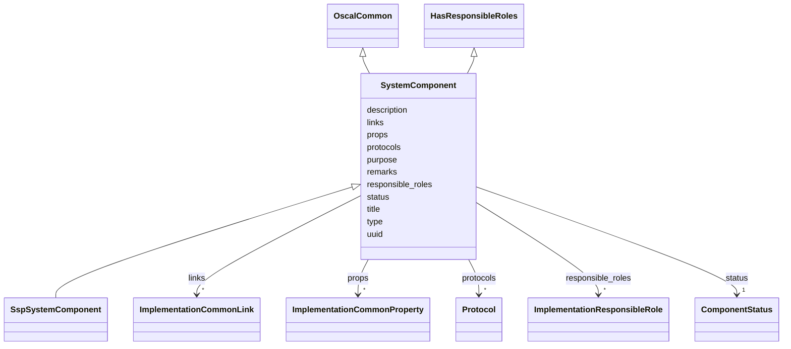

```mermaid
 classDiagram
    class SystemComponent
    click SystemComponent href "../SystemComponent"
      OscalCommon <|-- SystemComponent
        click OscalCommon href "../OscalCommon"
      HasResponsibleRoles <|-- SystemComponent
        click HasResponsibleRoles href "../HasResponsibleRoles"
      

      SystemComponent <|-- SspSystemComponent
        click SspSystemComponent href "../SspSystemComponent"
      

      SystemComponent : description
        
      SystemComponent : links
        
          
    
        
        
        SystemComponent --> "*" ImplementationCommonLink : links
        click ImplementationCommonLink href "../ImplementationCommonLink"
    

        
      SystemComponent : props
        
          
    
        
        
        SystemComponent --> "*" ImplementationCommonProperty : props
        click ImplementationCommonProperty href "../ImplementationCommonProperty"
    

        
      SystemComponent : protocols
        
          
    
        
        
        SystemComponent --> "*" Protocol : protocols
        click Protocol href "../Protocol"
    

        
      SystemComponent : purpose
        
      SystemComponent : remarks
        
      SystemComponent : responsible_roles
        
          
    
        
        
        SystemComponent --> "*" ImplementationResponsibleRole : responsible_roles
        click ImplementationResponsibleRole href "../ImplementationResponsibleRole"
    

        
      SystemComponent : status
        
          
    
        
        
        SystemComponent --> "1" ComponentStatus : status
        click ComponentStatus href "../ComponentStatus"
    

        
      SystemComponent : title
        
      SystemComponent : type
        
      SystemComponent : uuid
        
      
```
