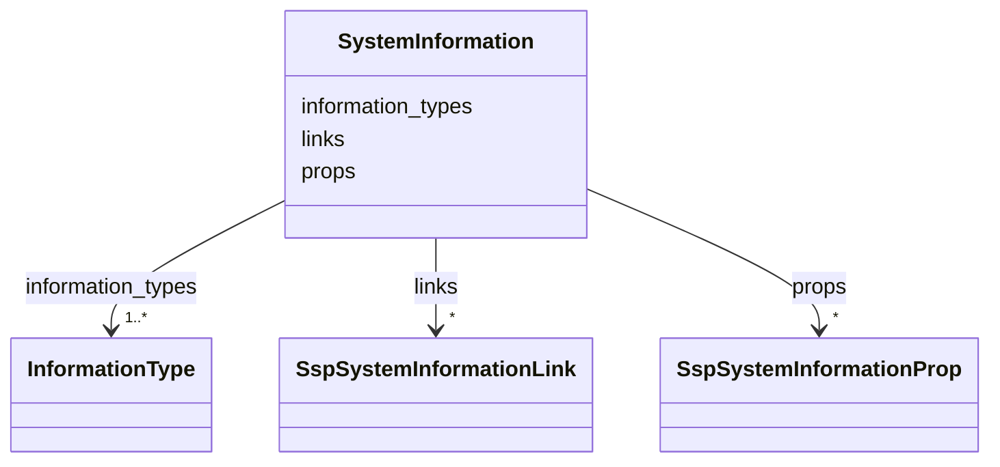

```mermaid
 classDiagram
    class SystemInformation
    click SystemInformation href "../SystemInformation"
      SystemInformation : information_types
        
          
    
        
        
        SystemInformation --> "1..*" InformationType : information_types
        click InformationType href "../InformationType"
    

        
      SystemInformation : links
        
          
    
        
        
        SystemInformation --> "*" SspSystemInformationLink : links
        click SspSystemInformationLink href "../SspSystemInformationLink"
    

        
      SystemInformation : props
        
          
    
        
        
        SystemInformation --> "*" SspSystemInformationProp : props
        click SspSystemInformationProp href "../SspSystemInformationProp"
    

        
      
```
