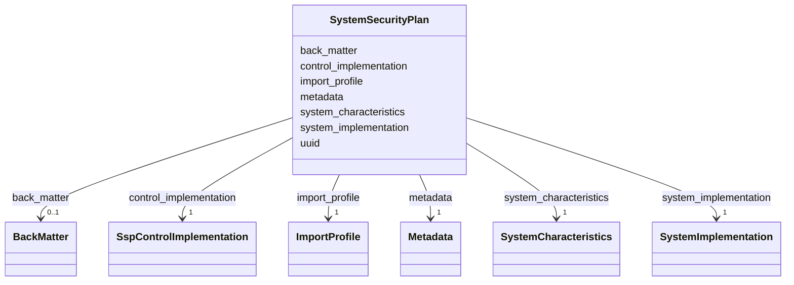

```mermaid
 classDiagram
    class SystemSecurityPlan
    click SystemSecurityPlan href "../SystemSecurityPlan"
      SystemSecurityPlan : back_matter
        
          
    
        
        
        SystemSecurityPlan --> "0..1" BackMatter : back_matter
        click BackMatter href "../BackMatter"
    

        
      SystemSecurityPlan : control_implementation
        
          
    
        
        
        SystemSecurityPlan --> "1" SspControlImplementation : control_implementation
        click SspControlImplementation href "../SspControlImplementation"
    

        
      SystemSecurityPlan : import_profile
        
          
    
        
        
        SystemSecurityPlan --> "1" ImportProfile : import_profile
        click ImportProfile href "../ImportProfile"
    

        
      SystemSecurityPlan : metadata
        
          
    
        
        
        SystemSecurityPlan --> "1" Metadata : metadata
        click Metadata href "../Metadata"
    

        
      SystemSecurityPlan : system_characteristics
        
          
    
        
        
        SystemSecurityPlan --> "1" SystemCharacteristics : system_characteristics
        click SystemCharacteristics href "../SystemCharacteristics"
    

        
      SystemSecurityPlan : system_implementation
        
          
    
        
        
        SystemSecurityPlan --> "1" SystemImplementation : system_implementation
        click SystemImplementation href "../SystemImplementation"
    

        
      SystemSecurityPlan : uuid
        
      
```
