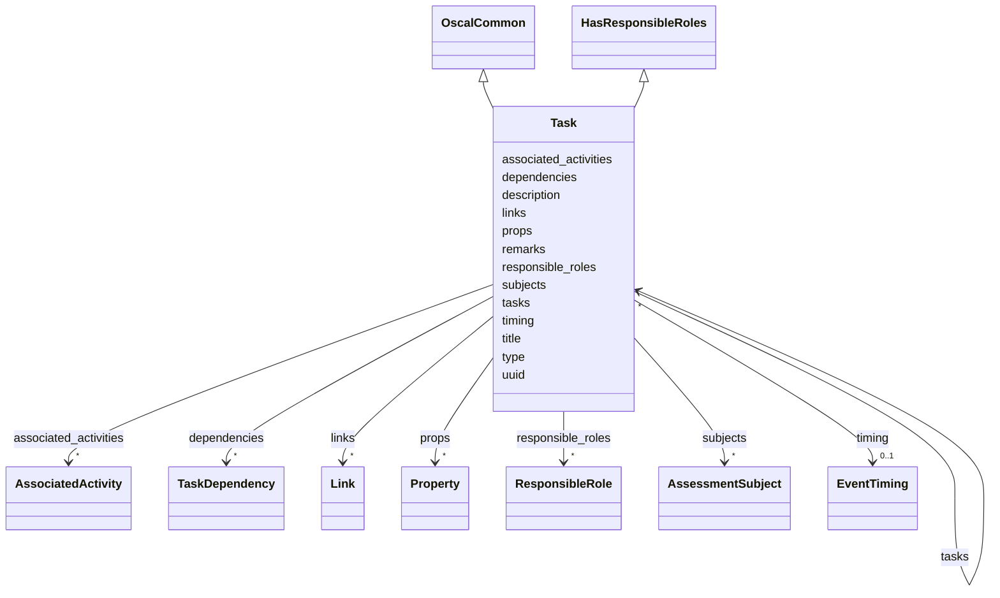

```mermaid
 classDiagram
    class Task
    click Task href "../Task"
      OscalCommon <|-- Task
        click OscalCommon href "../OscalCommon"
      HasResponsibleRoles <|-- Task
        click HasResponsibleRoles href "../HasResponsibleRoles"
      
      Task : associated_activities
        
          
    
        
        
        Task --> "*" AssociatedActivity : associated_activities
        click AssociatedActivity href "../AssociatedActivity"
    

        
      Task : dependencies
        
          
    
        
        
        Task --> "*" TaskDependency : dependencies
        click TaskDependency href "../TaskDependency"
    

        
      Task : description
        
      Task : links
        
          
    
        
        
        Task --> "*" Link : links
        click Link href "../Link"
    

        
      Task : props
        
          
    
        
        
        Task --> "*" Property : props
        click Property href "../Property"
    

        
      Task : remarks
        
      Task : responsible_roles
        
          
    
        
        
        Task --> "*" ResponsibleRole : responsible_roles
        click ResponsibleRole href "../ResponsibleRole"
    

        
      Task : subjects
        
          
    
        
        
        Task --> "*" AssessmentSubject : subjects
        click AssessmentSubject href "../AssessmentSubject"
    

        
      Task : tasks
        
          
    
        
        
        Task --> "*" Task : tasks
        click Task href "../Task"
    

        
      Task : timing
        
          
    
        
        
        Task --> "0..1" EventTiming : timing
        click EventTiming href "../EventTiming"
    

        
      Task : title
        
      Task : type
        
      Task : uuid
        
      
```
