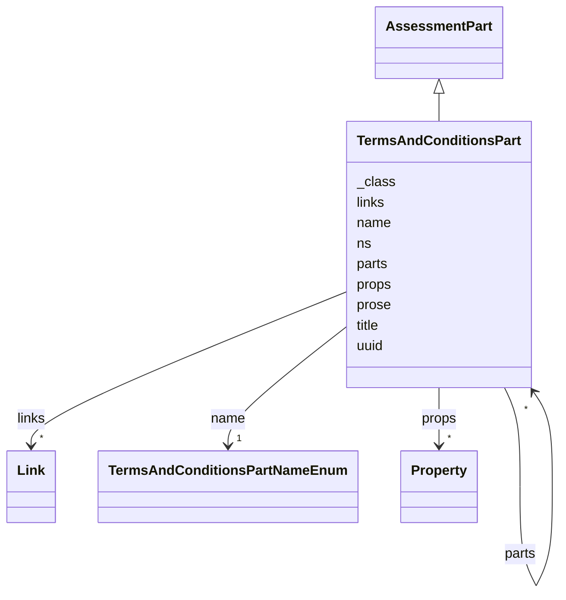

```mermaid
 classDiagram
    class TermsAndConditionsPart
    click TermsAndConditionsPart href "../TermsAndConditionsPart"
      AssessmentPart <|-- TermsAndConditionsPart
        click AssessmentPart href "../AssessmentPart"
      
      TermsAndConditionsPart : _class
        
      TermsAndConditionsPart : links
        
          
    
        
        
        TermsAndConditionsPart --> "*" Link : links
        click Link href "../Link"
    

        
      TermsAndConditionsPart : name
        
          
    
        
        
        TermsAndConditionsPart --> "1" TermsAndConditionsPartNameEnum : name
        click TermsAndConditionsPartNameEnum href "../TermsAndConditionsPartNameEnum"
    

        
      TermsAndConditionsPart : ns
        
      TermsAndConditionsPart : parts
        
          
    
        
        
        TermsAndConditionsPart --> "*" TermsAndConditionsPart : parts
        click TermsAndConditionsPart href "../TermsAndConditionsPart"
    

        
      TermsAndConditionsPart : props
        
          
    
        
        
        TermsAndConditionsPart --> "*" Property : props
        click Property href "../Property"
    

        
      TermsAndConditionsPart : prose
        
      TermsAndConditionsPart : title
        
      TermsAndConditionsPart : uuid
        
      
```
