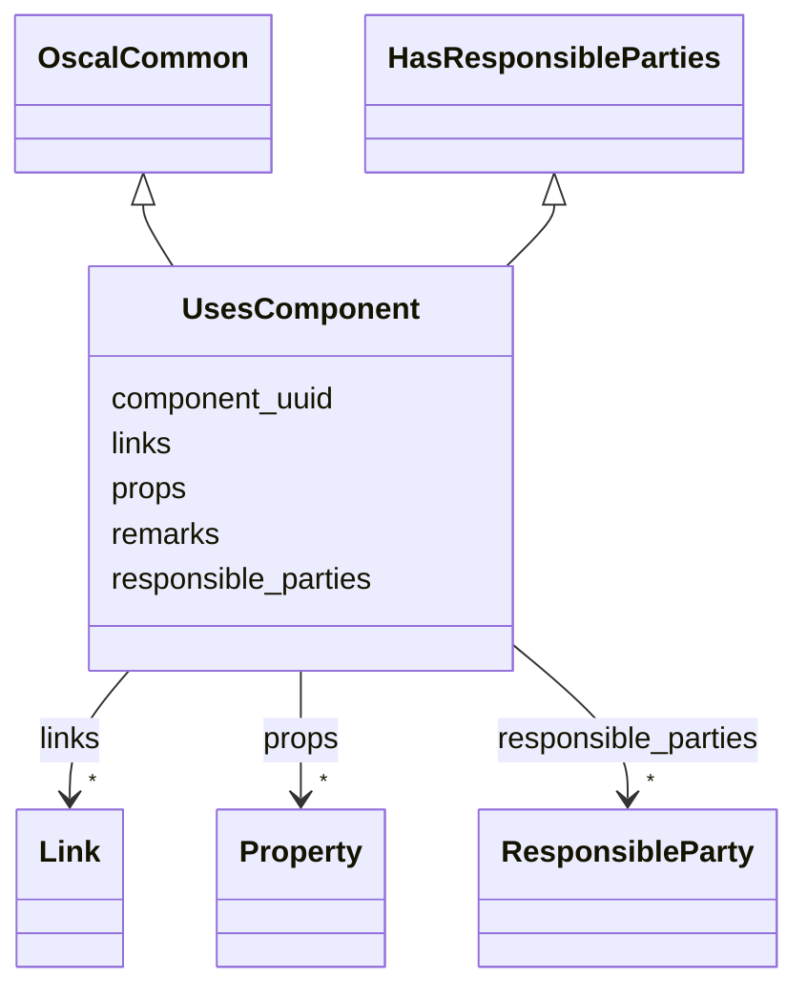

```mermaid
 classDiagram
    class UsesComponent
    click UsesComponent href "../UsesComponent"
      OscalCommon <|-- UsesComponent
        click OscalCommon href "../OscalCommon"
      HasResponsibleParties <|-- UsesComponent
        click HasResponsibleParties href "../HasResponsibleParties"
      
      UsesComponent : component_uuid
        
      UsesComponent : links
        
          
    
        
        
        UsesComponent --> "*" Link : links
        click Link href "../Link"
    

        
      UsesComponent : props
        
          
    
        
        
        UsesComponent --> "*" Property : props
        click Property href "../Property"
    

        
      UsesComponent : remarks
        
      UsesComponent : responsible_parties
        
          
    
        
        
        UsesComponent --> "*" ResponsibleParty : responsible_parties
        click ResponsibleParty href "../ResponsibleParty"
    

        
      
```
